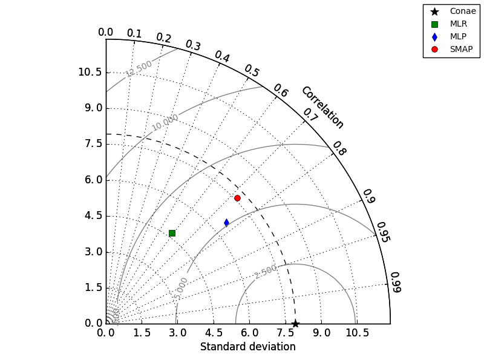

# Taylor-Diagram
Mathematical diagrams to indicate which of several models is most realistic. 

This diagram summarizes the values of standard deviation (x-axis and y-axis) and correlation coefficient (radial axis) obtained from the comparison between the results of the models and the observations in situ. The symbol with a star shape on the x-axis, called the reference point, represents the statistics of the data in situ. Also, the closer a result is to the reference point, the better the performance of the model.

  

Dependences:

    python - Sklearn
    python - NumPy
    python - Matplolib
    python - Statsmodels

Page source:

 Taylor diagram implementation developed by Yannick Copin (https://gist.github.com/ycopin) is used.
